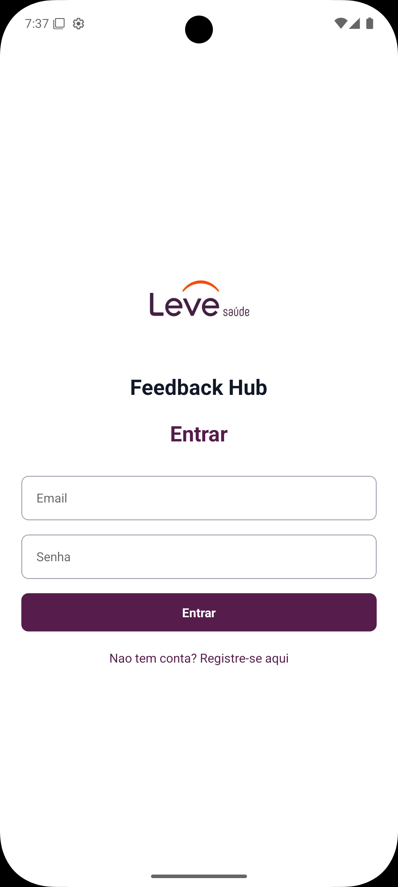
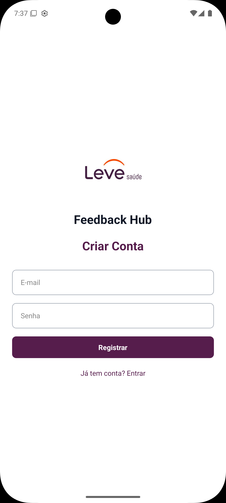
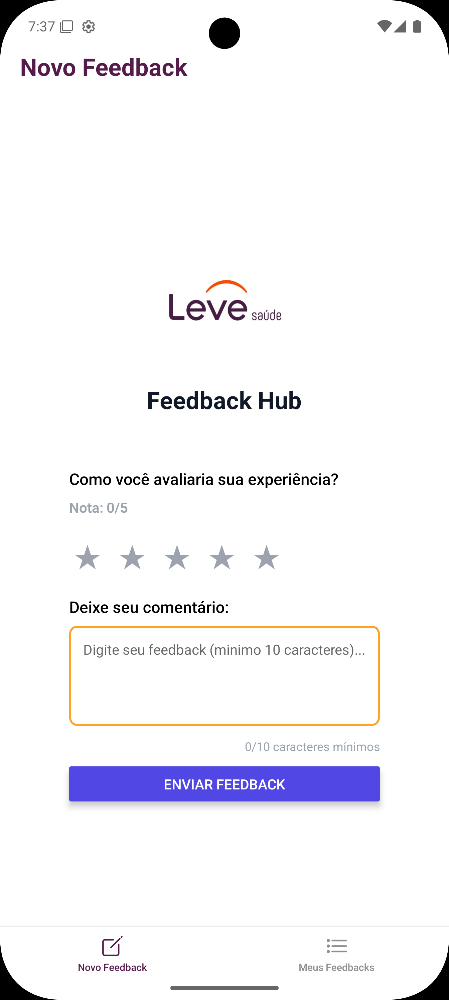

# FeedbackHub - Teste Técnico React Native

Aplicativo mobile para envio e listagem de feedbacks para usuário final, desenvolvido como teste técnico para vaga de desenvolvedor React/React Native.

## 📱 Sobre o Projeto

O FeedbackHub permite que usuários autenticados enviem feedbacks com nota (1 a 5 estrelas) e comentário, além de visualizar todos os feedbacks enviados por eles.

## 🚀 Tecnologias Utilizadas

- [Expo](https://expo.dev/)
- [React Native](https://reactnative.dev/)
- [TypeScript](https://www.typescriptlang.org/)
- [Firebase Auth & Firestore](https://firebase.google.com/)
- [EAS Build](https://docs.expo.dev/build/introduction/)
- ESLint + Prettier

## ⚙️ Funcionalidades

- Autenticação com Firebase (email e senha)
- Envio de feedback com nota (1 a 5 estrelas) e comentário (mínimo 10 caracteres)
- Listagem dos feedbacks enviados pelo usuário logado
- Exclusão de feedback
- Estilização com StyleSheet

## 🖼️ Screenshots

Veja abaixo algumas telas do aplicativo:

<p align="center">
  
  
  
  
</p>

## 🛠️ Configuração do EAS Build

O projeto utiliza o [EAS Build](https://docs.expo.dev/build/introduction/) para gerar builds nativas (APK, AAB, IPA).

1. **Instale o EAS CLI globalmente:**
   ```sh
   npm install -g eas-cli
   ```

2. **Faça login na sua conta Expo:**
   ```sh
   eas login
   ```

3. **Configure o projeto para EAS Build:**
   ```sh
   eas build:configure
   ```
   Isso irá gerar/atualizar o arquivo `eas.json` na raiz do projeto.

4. **Para gerar um build:**
   - Android:
     ```sh
     eas build -p android
     ```
   - iOS:
     ```sh
     eas build -p ios
     ```

   Siga as instruções do terminal para configurar certificados e perfis, se necessário.

## 📝 Como rodar o projeto

1. **Clone o repositório:**
   ```sh
   git clone https://github.com/PhelipeG/test-mobile-leve-saude.git
   cd test-mobile-leve-saude
   ```
2. **Instale as dependências:**
   ```sh
   npm install
   ```
3. **Configure o Firebase:**
   - As credenciais do Firebase já estão configuradas no projeto para testes temporários.
   - **Atenção:** Essas credenciais serão removidas posteriormente por motivos de segurança.
   - Caso queira utilizar seu próprio projeto Firebase, renomeie o arquivo `.env.example` para `.env` e insira suas credenciais.

4. **Rode o aplicativo:**
   ```sh
   npm start
   ```
   - Utilize o Expo Go no seu dispositivo móvel para escanear o QR Code e abrir o aplicativo.

## 📧 Contato

- **Nome:** Luis Felipe Silva 
- **Email:** luisphelipe1000@gmail.com
- **LinkedIn:** [linkedin.com/in/luis-felipe-silv](https://www.linkedin.com/in/luis-felipe-silv)

Sinta-se à vontade para entrar em contato para mais informações ou oportunidades de colaboração!